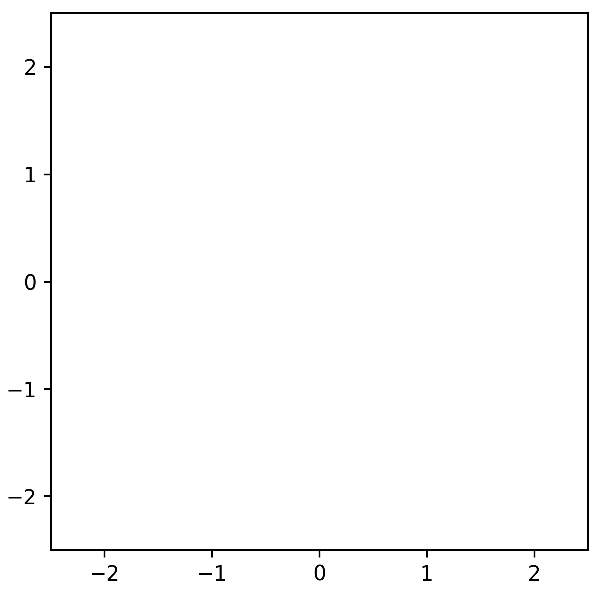

# KTH Logo Dataset
A toy dataset based on KTH's logotype.
- Uniformly sampled from the logo
- Standardized: $x' = \frac{x - \textrm{mean}(x)}{\textrm{std}(x)}$
- Interface similar to [scikit-learn's toy datasets](https://scikit-learn.org/stable/datasets/toy_dataset.html).



## Install

```shell
pip install git+https://github.com/klaswijk/kth-dataset
```

## Usage

```python
from kth_dataset import make_kth_dataset

x, y = make_kth_dataset(
    n_samples=1000,
    noise=0.0,  # Standard deviation of Gaussian noise
    path=".",
    download=True,  # Downloads kth_logo.png to path
    random_state=0
)

# x is a (n_samples, 2) array containing the samples 
# y is all zeroes
```
